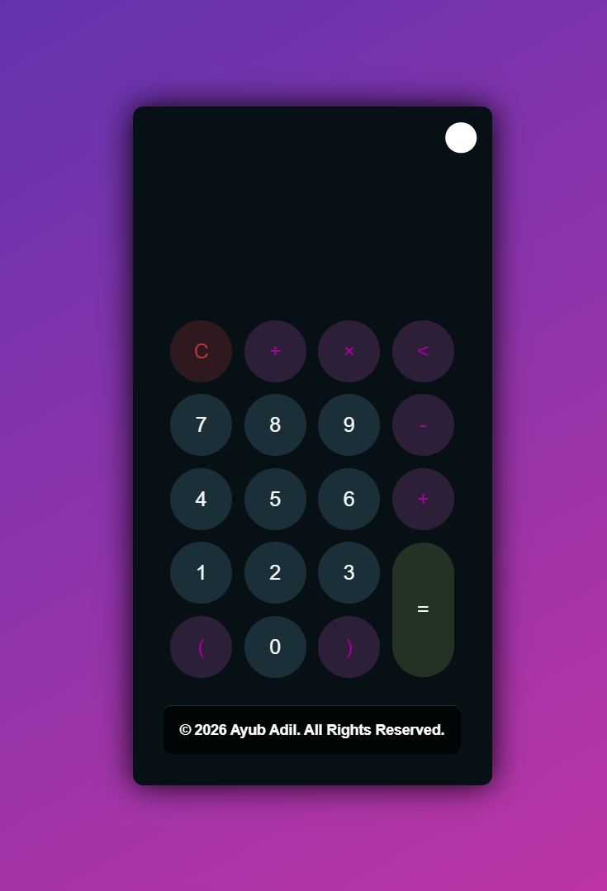
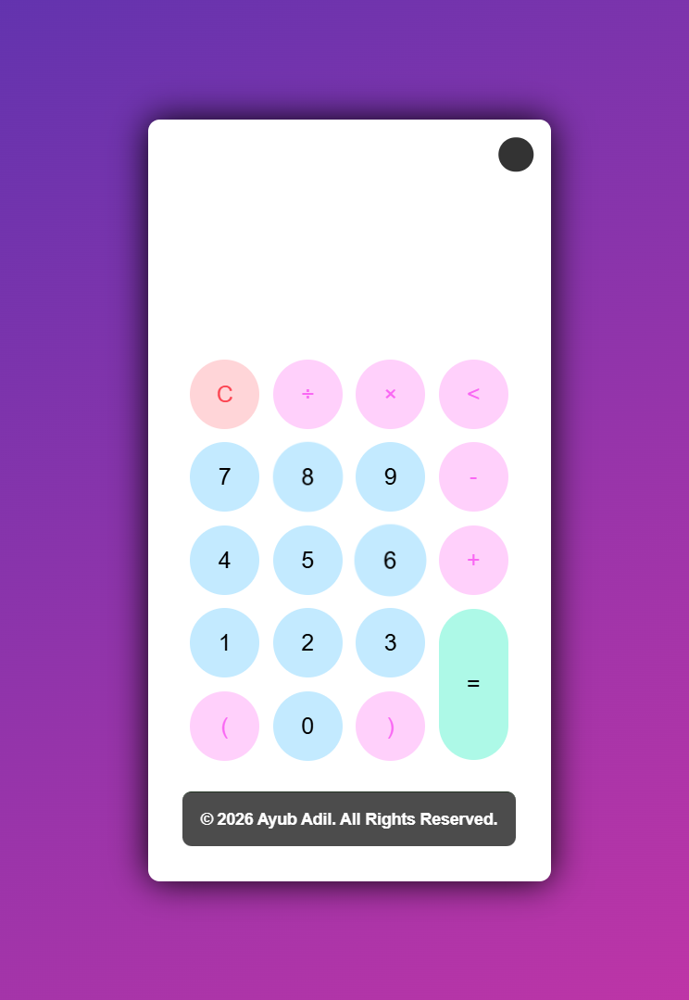

# 🧮 Calculator Web App

A modern and responsive **Calculator Web Application** built using HTML, CSS, and JavaScript. It supports basic arithmetic operations along with a clean UI and theme toggle feature.

---

## 🚀 Features

* ➕ Addition, ➖ Subtraction, ✖️ Multiplication, ➗ Division
* 🔢 Number input (0–9)
* 🧠 Supports brackets `( )`
* 🧹 Clear screen (C button)
* ⬅️ Backspace functionality
* 🎯 Real-time display updates
* 🌙 Dark/Light theme toggle

---

## 🛠️ Technologies Used

* **HTML5** – Structure
* **CSS3** – Styling and themes
* **JavaScript** – Logic and calculations

---

## 📂 Project Structure

```bash
Calculator/
│── index.html
│── style.css
│── script.js
```

---

## 📸 Preview

### 🌙 Dark Mode


### 💡Light Mode


---

## ⚙️ How to Run

1. Download or clone the repository
2. Place all files in the same folder
3. Open `index.html` in any browser

---

## 💡 How It Works

* User clicks buttons to input numbers and operators
* Expression is displayed on the screen
* Clicking `=` evaluates the expression using JavaScript
* `C` clears everything and `<` removes last character

---

## 🔮 Future Improvements

* 📱 Better mobile responsiveness
* ⌨️ Keyboard input support
* 📊 Scientific calculator functions
* 💾 History of calculations
* 🎨 More themes

---

## 👨‍💻 Author

**Ayub Adil**
© 2026 All Rights Reserved

---

## 📌 Note

This project was developed as part of a web development learning journey to strengthen fundamental concepts and build hands-on experience.
